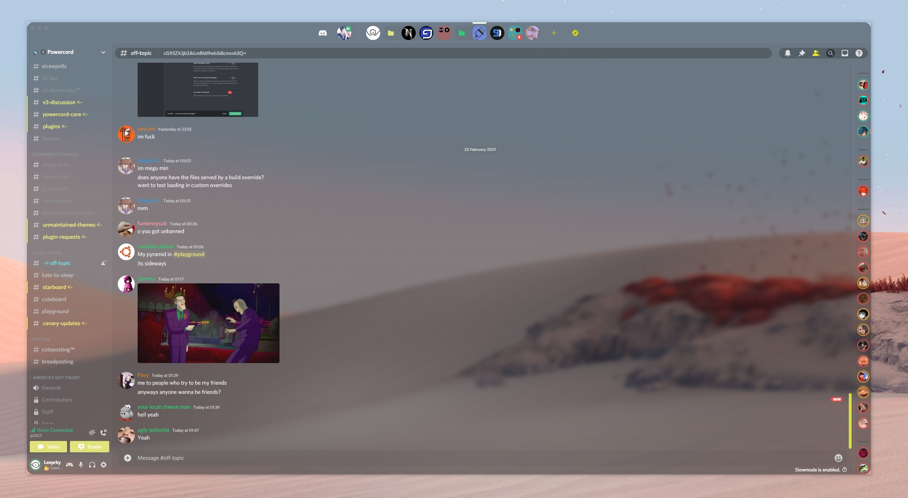

# cybercord transparent
a A Discord Powercord Based Glasscord Theme!

THIS IS A WORK IN PROGRESS SO MAKE SURE TO "git pull" EVERY NOW AND THEN THANKS.

A Discord theme based on Cyberpunk 2077 /w  Modern Traits.
## install

Firstly You will Need Glasscord API, 
CLick here: https://github.com/AryToNeX/Glasscord/wiki/Installation & Then once its installed continue to the next step
( Video Version: https://www.youtube.com/watch?v=ucZC2x3yc24 )

Head to C:\Users\[USER]\powercord\src\Powercord

Right Click "themes" and click Git Bash Here

Type "git clone https://github.com/leeprky/cybercordtheme-transparent"

Refresh Discord

## info

If you want your server list at the top use https://github.com/DiscordStyles/HorizontalServerList

## license

MIT, see LICENSE.md for more details

## previews

